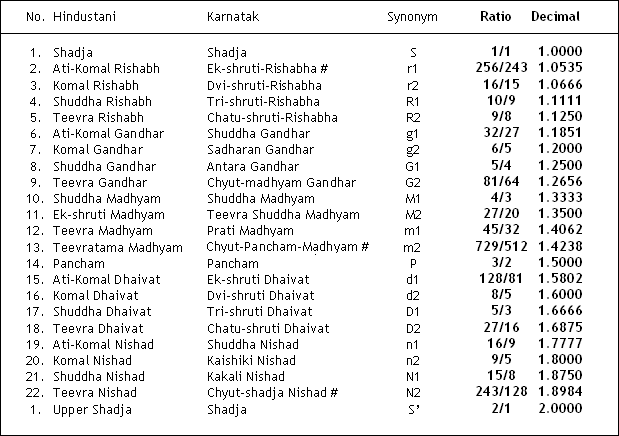

# shruti-practice

Indian classical music note practice app created using Tone.js and Vue.js

## Basis
Based on research by Dr. Vidhyadhar Oke at http://www.22shruti.com/

## Shruti names and frequency fraction mapping

